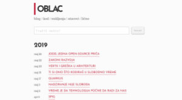
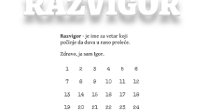
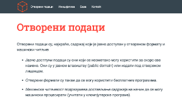

# Show Cases

## Home page

+ [Live](https://igo.rs), [Code](https://github.com/igr/igo.rs)
+ Simple page

## Blog

+ [Live](https://oblac.rs), [Code](https://github.com/igr/blog)
+ posts (blog)
+ tags
+ reading time
+ global rename of pages
+ sitemap
+ rss
+ collect by year

## Razvigor

+ [Live](https://razvigor.com), [Code](https://github.com/igr/razvigor)

+ posts
+ different layouts
+ custom sort

## OpenData

+ [Live](https://opendata.rs), [Code](https://github.com/heapspace/opendata)

+ data and data pages
+ menu
